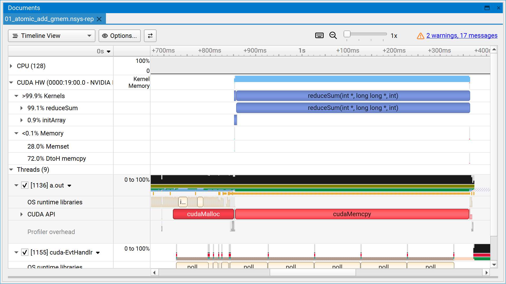
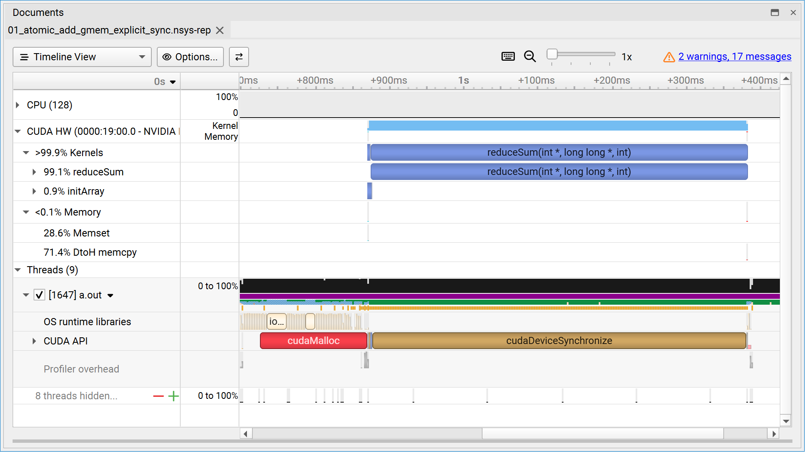
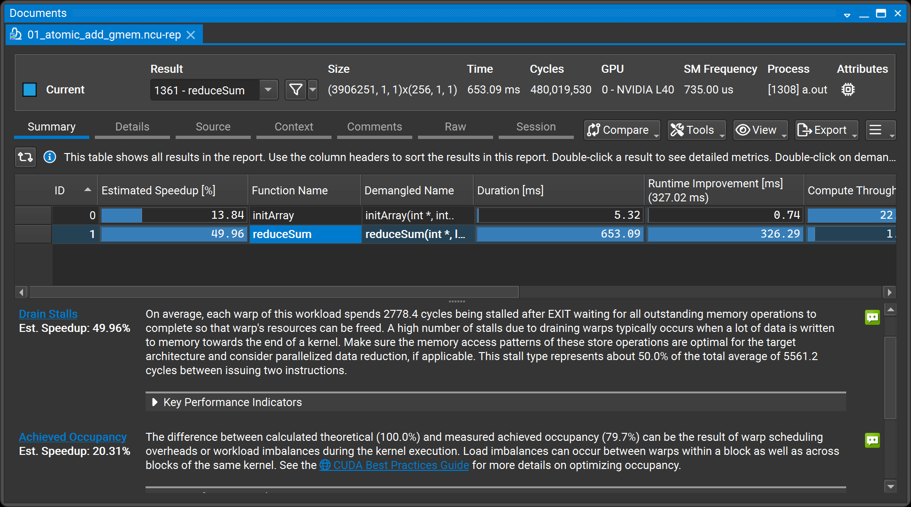
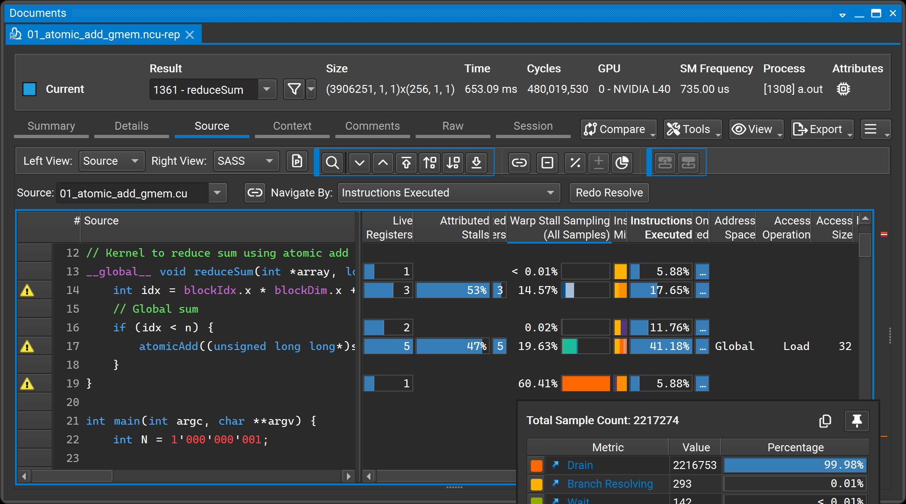
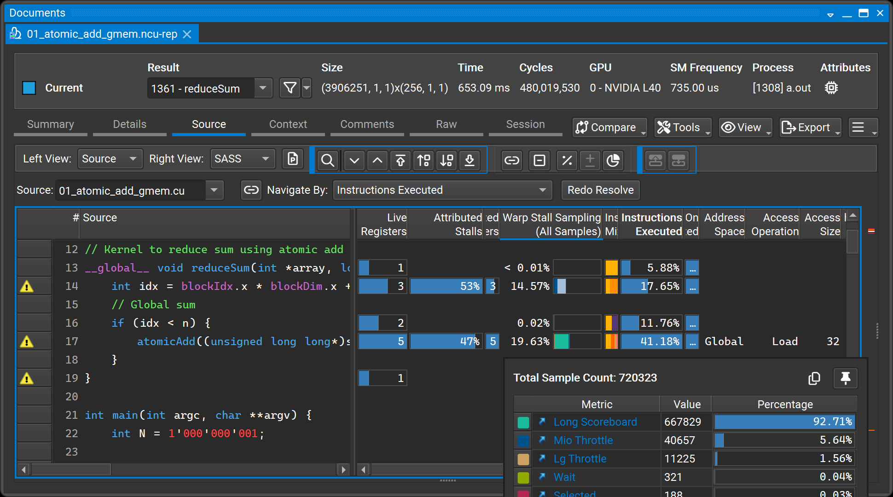
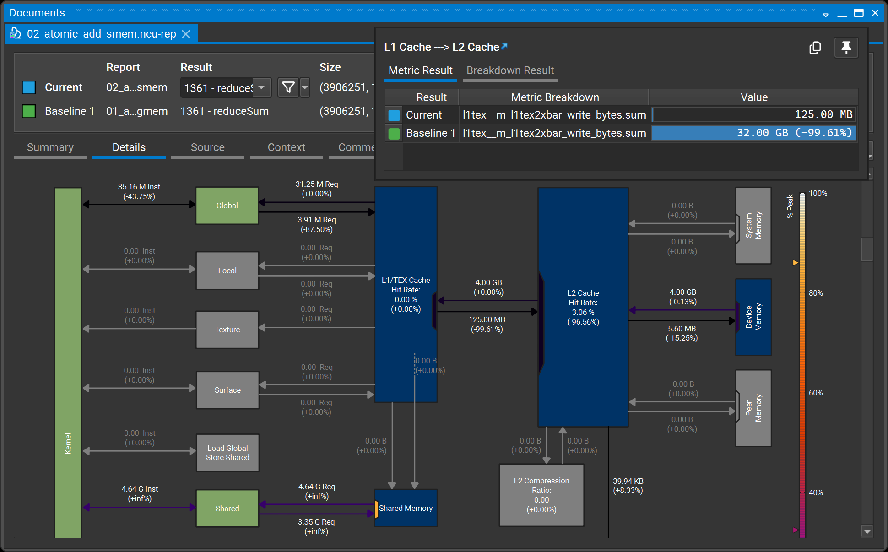
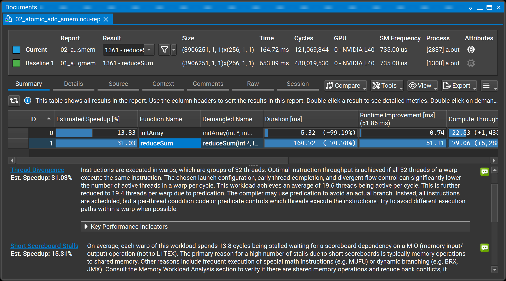
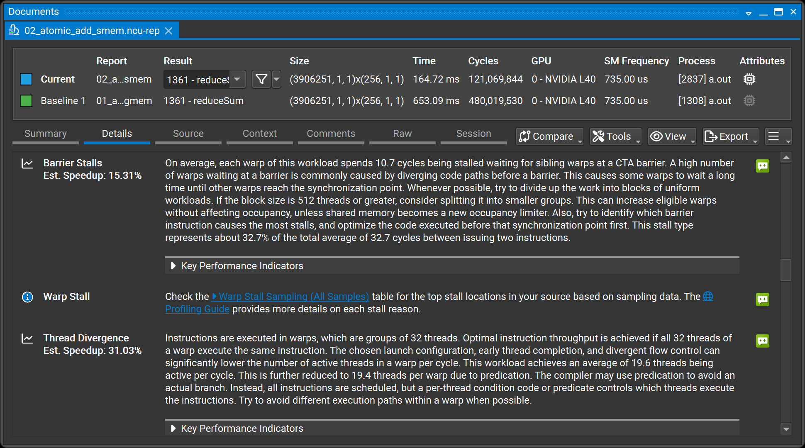
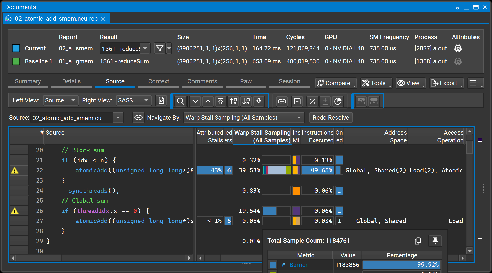
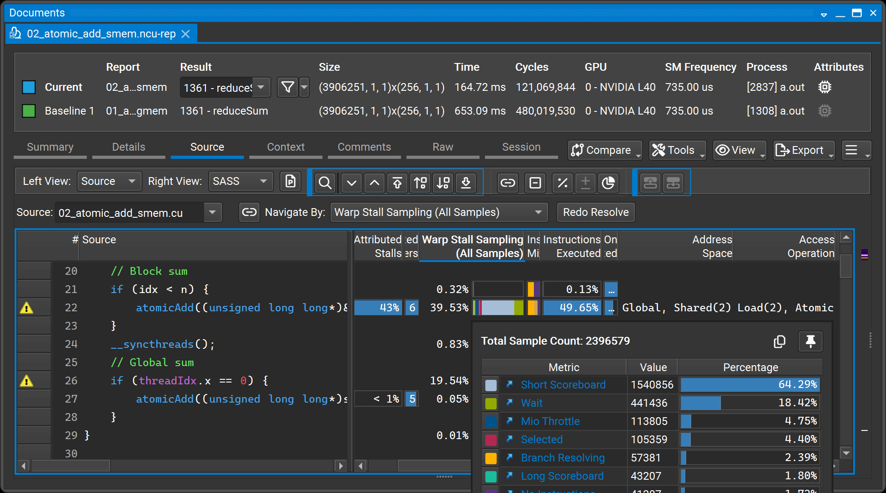

# Nsight Guided Profiling

## Prerequisites

- [Nsight Systems](https://developer.nvidia.com/nsight-systems/get-started)
- [Nsight Compute](https://developer.nvidia.com/tools-overview/nsight-compute/get-started)

Downloading the two Nsight GUIs are sufficient, as we have provide pre-profiled reports for the examples in the repository.

## (Optional) Profiler and Container Setup

System configuration following [docs](https://docs.nvidia.com/nsight-systems/InstallationGuide/index.html#requirements-for-x86-64-and-arm-sbsa-targets-on-linux):

```sh
cat /proc/sys/kernel/perf_event_paranoid
sudo sh -c 'echo 2 >/proc/sys/kernel/perf_event_paranoid'
```

Launch container with [`SYS_ADMIN` caps](https://docs.nvidia.com/nsight-systems/UserGuide/index.html#container-and-scheduler-support):

```sh
cd src
docker run --rm -it --gpus all \
  --cap-add=SYS_ADMIN \
  -v $PWD:/app \
  j3soon/hpc-samples:nvhpc-25.7-devel-cuda12.9-ubuntu24.04
# in the container
nsys status -e
```

## Nsight

- Nsight Systems

  See the [user guide](https://docs.nvidia.com/nsight-systems/UserGuide/index.html) for more details.

  Default `nsys profile` flags:

  ```
  nsys profile --stats=false -t cuda,opengl,nvtx,osrt --cudabacktrace=none [executable] [executable options]
  ```

- Nsight Compute

  See the [documentation](https://docs.nvidia.com/nsight-compute/) for more details.

<!--

### Real Hello World

```sh
cd /app/cpp/cuda

nvcc real-hello-world.cu
nsys profile ./a.out # real-hello-world.nsys-rep
nsys profile --cudabacktrace=all ./a.out # real-hello-world_cudabacktrace.nsys-rep

nvcc real-hello-world-nvtx.cu
nsys profile -t cuda,nvtx,osrt ./a.out # real-hello-world-nvtx.nsys-rep
```

Learnings:
- Nsight Systems GUI
  - Timeline View
  - Events View
- Host side `CUDA API` calls
  - backtrace (`--cudabacktrace=all`), large runtime overhead
- Device side `CUDA HW Kernels`
  - kernel duration, and measurements (`+Xs`)
  - kernel information (grid/block size, registers, etc.)
  - and host launch overhead
- [NVTX](https://github.com/NVIDIA/NVTX)
- Traces: `cuda`, `osrt`, `nvtx`
- (Optional) Stats report

-->

### Parallel Reduce Sum

In the container:

```sh
cd /app/cpp/cuda/reduce_sum
```

and run all tests:

```sh
./test_all.sh
```

If you don't have an environment, download the reports from [here](https://github.com/j3soon/hpc-samples/releases).

- [01_atomic_add_gmem.cu](src/cpp/cuda/reduce_sum/01_atomic_add_gmem.cu) (653.09 ms)

  
  

  > Observe: (1) CUDA HW: Kernel & Memory utilization. (2) Kernels/Memory: Memset -> initArray -> reduceSum -> Memcpy DtoH. (3) Threads -> CUDA API: `reduceSum` kernel launch is quick, waiting for the blocking `cudaMemcpy` call. (4) The lower image shows the timeline with explicit `cudaDeviceSynchronize` after the kernel, which shows the GPU/CPU timeline more clearly, and the GPU runtime should not be mistaken with the blocking `cudaMemcpy` call.

  
  
  

  > Observe: (1) Summary: Make sure to click on the target kernel row in the table. (2) `Drain Stalls (Est. Speedup: 49.96%)`. Click it and follow the links to L19/L17. (3) Source: `Stall Sampling`, L19 `Drain`, L17 atomicAdd `Long Scoreboard`. (4) Click the metric name for further information. (5) Summary: right-click the kernel and select `Add Baseline(s)` for later comparison.

  Based on `Drain` and `Long Scoreboard`, we can infer that the bottleneck is due to global memory atomic operations. The next step is to optimize the kernel by using shared memory for partial reductions before writing to global memory.

- [02_atomic_add_smem.cu](src/cpp/cuda/reduce_sum/02_atomic_add_smem.cu) (164.72 ms)

  
  
  
  
  

  > Observe: (0) Improved: significant reduction in `Details > Memory Workload Analysis > Memory Chart > L2 Cache Writes` by utilizing Shared Memory. (1) `Thread Divergence (Est. Speedup: 31.03%)`, `Short Scoreboard Stalls (Est. Speedup: 15.31%)`, `Barrier Stalls (Est. Speedup: 15.31%)`. Click the first metric and follow the links to L26/L22. (2) Source: `Stall Sampling`, L26 syncthreads `Barrier`, L22 atomicAdd `Short Scoreboard`.

  Based on `Thread Divergence`, and `* Stalls`, we can infer that the bottleneck is due to thread divergence and synchronization overhead in the shared memory reduction. The next step is to optimize the reduction algorithm to minimize thread divergence and synchronization.

- [03_interleaved_addressing.cu](src/cpp/cuda/reduce_sum/03_interleaved_addressing.cu) (27.00 ms)

  * Improved: Shared Memory Bottleneck
  * Summary: Uncoalesced Shared Accesses (Est. Speedup: 37.79%), Shared Load Bank Conflicts (Est. Speedup: 24.17%), Thread Divergence (Est. Speedup: 18.76%)

- [04_interleaved_addressing_non_divergent.cu](src/cpp/cuda/reduce_sum/04_interleaved_addressing_non_divergent.cu) (20.98 ms)

  * Improved: Thread Divergence
  * Summary: Uncoalesced Shared Accesses (Est. Speedup: 70.86%), Shared Load Bank Conflicts (Est. Speedup: 60.72%), Shared Store Bank Conflicts (Est. Speedup: 51.40%)

- [05_sequential_addressing.cu](src/cpp/cuda/reduce_sum/05_sequential_addressing.cu) (17.95 ms)

  * Improved: Shared Memory Bank Conflicts
  * Summary: Thread Divergence (Est. Speedup: 36.69%)

- [06_first_add_during_load.cu](src/cpp/cuda/reduce_sum/06_first_add_during_load.cu) (9.28 ms)

  * Improved: Thread Divergence (due to half of the threads in the block are idle after loading to shared memory). Details > Source Counter > Branch Instructions.
  * Summary: Thread Divergence (Est. Speedup: 34.89%)

- [07_unroll_last_warp.cu](src/cpp/cuda/reduce_sum/07_unroll_last_warp.cu) (5.05 ms)

  * Improved: Reduced thread synchronization at previous L22 and current L36 Barrier. Details > Source Counter > Branch Instructions.
  * Summary: Achieved Occupancy (Est. Speedup: 8.14%), Long Scoreboard Stalls (Est. Speedup: 8.14%)

- [08_complete_unroll.cu](src/cpp/cuda/reduce_sum/08_complete_unroll.cu) (4.88 ms)

  * Improved: Details > Source Counter > Branch Instructions.
  * Summary: Achieved Occupancy (Est. Speedup: 5.02%), Long Scoreboard Stalls (Est. Speedup: 5.02%)

- [09_warp_shuffle.cu](src/cpp/cuda/reduce_sum/09_warp_shuffle.cu) (4.79 ms)

  * Improved: Details > Memory Workload Analysis > Memory Chart > Shared Memory
  * Summary: Achieved Occupancy (Est. Speedup: 3.18%), Long Scoreboard Stalls (Est. Speedup: 3.18%)

- [10_grid_stride_loop.cu](src/cpp/cuda/reduce_sum/10_grid_stride_loop.cu) (4.78 ms)

  * Improved: Details > Instruction Statistics > Executed Instructions
  * Summary: Achieved Occupancy (Est. Speedup: 2.99%), Long Scoreboard Stalls (Est. Speedup: 2.99%)

- [11_grid_size.cu](src/cpp/cuda/reduce_sum/11_grid_size.cu) (4.75 ms)

  * Improved: Details > Occupancy > Achieved Occupancy
  * Summary: Long Scoreboard Stalls (Est. Speedup: 2.24%)

The main performance bottleneck is due to Long Scoreboard Stalls. Further optimizations could explore advanced CUDA features such as LDGSTS and TMA instructions.

**Runtime statistics summary**:

| File | Runtime |
| --- | --- |
| `01_atomic_add_gmem.cu` | 653.09 ms |
| `02_atomic_add_smem.cu` | 164.72 ms |
| `03_interleaved_addressing.cu` | 27.00 ms |
| `04_interleaved_addressing_non_divergent.cu` | 20.98 ms |
| `05_sequential_addressing.cu` | 17.95 ms |
| `06_first_add_during_load.cu` | 9.28 ms |
| `07_unroll_last_warp.cu` | 5.05 ms |
| `08_complete_unroll.cu` | 4.88 ms |
| `09_warp_shuffle.cu` | 4.79 ms |
| `10_grid_stride_loop.cu` | 4.78 ms |
| `11_grid_size.cu` | 4.75 ms |

## References

- [Optimizing Parallel Reduction in CUDA by Mark Harris](https://developer.download.nvidia.com/assets/cuda/files/reduction.pdf)
- [Introduction to CUDA Programming and Performance Optimization](https://www.nvidia.com/en-us/on-demand/session/gtc24-s62191/)
- [Using CUDA Warp-Level Primitives](https://developer.nvidia.com/blog/using-cuda-warp-level-primitives/)
